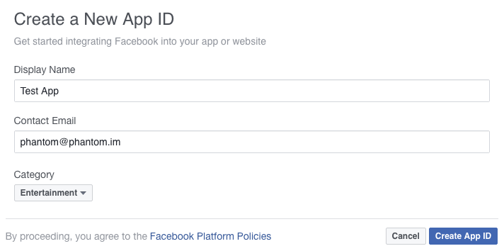
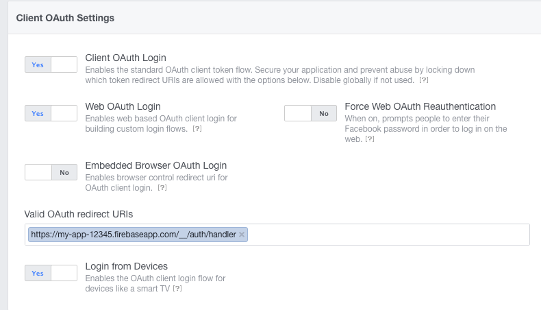

# Facebook

This guide will help you configure Facebook for your Firebase Auth app.

You will be required to provide a redirect URI, the URI should be similar to: `https://my-app-12345.firebaseapp.com/__/auth/handler`

You only need to change the project name in the beginning of the URI.

## Configuring

1. Register in the [Facebook Developer portal](https://developers.facebook.com/). You may be asked to provide a valid cell phone number to complete your registration.
2. Once registered, locate a drop-down list in the top right and click on it. At the middle it will be an option to `Add a New App`.
3. You will be presented with 4 options, select `Website` (even if you are developing an Android or iOS app). We can later add the other platforms when we are ready for deployment.
4. Click the button that says `Skip and Create App ID`. A form will appear where you have to provide your app details, once finished click the `Create App ID` button.

5. You will be redirected to your `Dashboard`, click the `Get Started` button next to the `Facebook Login` option.
6. Configure the OAuth settings similar to the next image. Remember to set the correct redirect URI and press the `Save Changes` button.

7. Click `Settings` in the left side menu. You will be presented with a screen with your `App ID` and `App Secret`, you will be required to provide your Facebook password to see the `App Secret`.
8. Once authorized, copy down your `App ID` and `App Secret`. We are going to use them in a later step.

At this point the Facebook API will only work with your own Facebook Account, in order for it to work on any account you need to switch your app status from `development` to `public`.

9. If you are still in the `Dashboard` click the `App Review` option in the left side menu.

10. In the `Make [Your App Name] public?` section turn it to `Yes`. A pop-up will appear asking if you want to make your app public, click the `Confirm` button.

With these settings your app will only be allowed to do reading operations with the Facebook API. If you want to do writing operations such as `Liking` and posting to the user wall you must submit your app for review.

11. Go back to the [Firebase console](https://firebase.google.com) and select your project.
12. Click the `Auth` option in the left side menu.
13. Click the `SIGN-IN METHOD` button in the top menu and then select `Facebook` from the providers list.
14. Click the `Enable` toggle button and set it to `on`, you will be asked for the `App ID` and `App Secret`.
15. Once you have finished filling the form press the `Save` button.

The Facebook provider has been successfully enabled and configured.