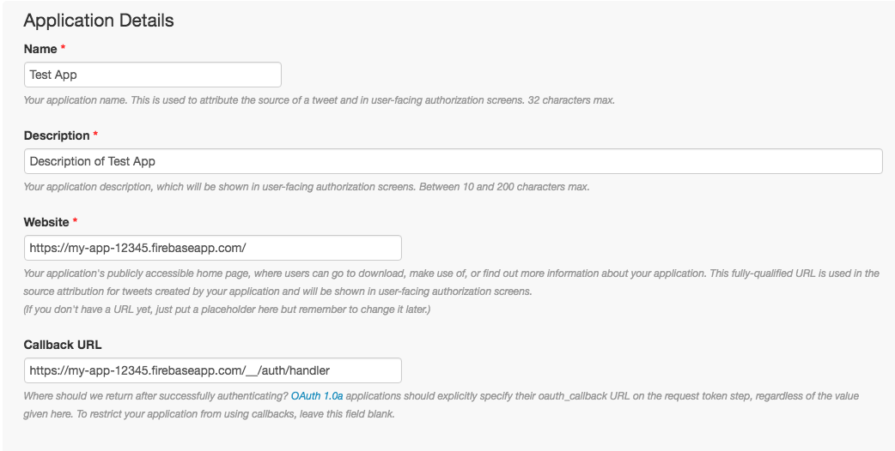

# Twitter

This guide will help you configure Twitter for your Firebase Auth app.

You will be required to provide a redirect URI, the URI should be similar to: `https://my-app-12345.firebaseapp.com/__/auth/handler`

You only need to change the project name in the beginning of the URI.

## Configuring

1. Register in the [Twitter Developer portal](https://dev.twitter.com). You may be asked to provide a valid cellphone number to complete your registration.
  
2. Once registered locate a button that says `Create New App` and click it.
  
3. Fill all the fields as normally. Once you reach the Callback URL, provide the URL previously mentioned.

4. Go to the Settings tab and make sure these two options are checked:

* Enable Callback Locking (It is recommended to enable callback locking to ensure apps cannot overwrite the callback url).
* Allow this application to be used to Sign in with Twitter.

5. Go to the `Keys and Access Tokens` tab and copy down your `Consumer Key` and `Consumer Secret`.
6. Go back to the [Firebase console](https://firebase.google.com) and select your project.
7. Click the `Auth` option in the left side menu.
8. Click the `SIGN-IN METHOD` button in the top menu and then select `Twitter` from the providers list.
9. Click the `Enable` toggle button and set it to `on`, you will be asked for the `API Key` and `API secret` which are the `Consumer Key` and `Consumer Secret` respectively.
10. Once you have finished filling the form press the `Save` button.

The Twitter provider has been successfully enabled and configured.