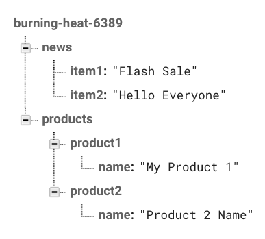
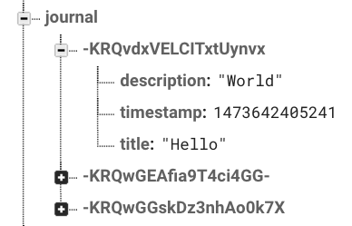

# Firebase Database

Firebase offers a very flexible and secure way to save text-based data.

This guide will show some of the most common scenarios and it will explain how to use Rules for your database. It is also written from ActionScript and SQL perspectives.

A simple `CRUD` [example](./examples) has been provided for your convenience, it only requires a recent version of `Apache Flex`.

## Understanding the Data

The data saved in the Firebase database is structured like a tree. Each 'branch' can have its own branches and those sub branches can have their own sub branches.



The Firebase data can only be retrieved as JSON, you will require to use the JSON class to convert the data into an ActionScript Object.

## Firebase Rules

The Firebase Rules are a flexible way to set permissions on who can access certain data.

By default all the data is private and can only be accessed by Authenticated users.

To modify the Rules follow these steps:

1. Open the [Firebase console](https://firebase.google.com)
2. Select your project.
3. Click on the Database option from the left side menu.
4. Click on `RULES` from the top menu.

## Public

Let's say you want to create a public feed with the contents of a node named `news`, so everyone on the Internet can read it.

```json
{
    "rules": {
        "news": {
            ".read": true,
            ".write": false
        }
    }
}
```

These rules mean that anyone can read the `news` node, but no one can write (modify) them.

Now you want to make a public message board where anyone can post anything, one example could be an app that receives anonymous feedback.

```json
{
    "rules": {
        "feedback": {
            ".read": true,
            ".write": true
        }
    }
}
```

This is not a very good idea since users that know how Firebase works can manipulate the messages or delete them.
For this case it is recommended to use `Anonymous` auth.

## Private (Registered Users only)

Let's say you have another node named `specialoffers` and you want them to only be accessed by registered users from your app.

```json
{
    "rules": {
        "specialoffers": {
            ".read": "auth != null",
            ".write": false
        }
    }
}
```

This rule is almost the same as the default one, the only difference is that it specifies which node to protect.

## Private (User Specific)

This is where Firebase auth and rules are best used; each user can save their own data that they can only read and write.

A real life example: an app where users can manage a To-Do list.

```json
{
    "rules": {
        "todos": {
            "$user_id": {
                ".read": "$user_id === auth.uid",
                ".write": "$user_id === auth.uid"
            }
        }
    }
}
```

We have a main `todos` node. Inside that node each user will have their own sub node.
Each sub node wil contain the to do's from the specified user.

The `auth.uid` parameter means the following:

* `auth` is an Object inside an Authentication Token (see below).
* `uid` is an unique id that is assigned to each user in your Firebase project. This uid is also known as the `localId`

`$user_id` is an arbitrary variable name that will contain the value from the `auth.uid`, this way the user's node is named the same as its uid. Making impossible to be repeated or be loaded by accident by another user.

## Authentication Token

An Authentication Token is an encoded string that contains information about the user that is trying to perform an operation against the database.

The default expiration time of a Firebase generated Authentication token is 60 minutes.

There are several ways to generate these tokens, this guide will only explain how to do it using Google Identity Toolkit so you won't require to do Crytographic wizardy.

The first time a user authenticates and everytime they re-authenticate in your app, you will need to read the response JSON. It will contain a very special value, the `idToken`.

This `idToken` will be exchanged for an `access_token` which is actually the `Authentication token`, it contains all the information required for a successful Database/Storage authentication.  

```actionscript
private function getAccessToken(idToken:String):void
{
	var header:URLRequestHeader = new URLRequestHeader("Content-Type", "application/json");
			
	var myObject:Object = new Object();
	myObject.grant_type = "authorization_code";
	myObject.code = idToken;			
			
	var request:URLRequest = new URLRequest("https://securetoken.googleapis.com/v1/token?key="+FIREBASE_API_KEY);
	request.method = URLRequestMethod.POST;
	request.data = JSON.stringify(myObject);
	request.requestHeaders.push(header);
			
	var loader:URLLoader = new URLLoader();
	loader.addEventListener(flash.events.Event.COMPLETE, accessTokenLoaded);
	loader.addEventListener(IOErrorEvent.IO_ERROR, errorHandler);
	loader.load(request);	
}
		
private function accessTokenLoaded(event:flash.events.Event):void
{
    event.currentTarget.removeEventListener(flash.events.Event.COMPLETE, accessTokenLoaded);
    var rawData:Object = JSON.parse(event.currentTarget.data);
    var FirebaseAuthToken:String = rawData.access_token;
}

private function errorHandler(event:flash.events.IOErrorEvent):void
{
	trace(event.currentTarget.data);
}
``` 

Once you have got the `access_token` you are ready to perform secure operations against the Firebase database.

## Reading the Database

Connecting to the database is rather simple, you only require an `URLRequest` and an `URLLoader`.

To load a Public resource use the following code (this is the equivalent of a `SELECT` in `SQL`):

```actionscript
private function loadNews():void
{
    var request:URLRequest = new URLRequest("https://<YOUR-PROJECT-ID>.firebaseio.com/news.json");
			
    var loader:URLLoader = new URLLoader();
    loader.addEventListener(flash.events.Event.COMPLETE, newsLoaded);
    loader.load(request);
}
		
private function newsLoaded(event:flash.events.Event):void
{
    event.currentTarget.removeEventListener(flash.events.Event.COMPLETE, newsLoaded);
    trace(event.currentTarget.data);
    var rawData:Object = JSON.parse(event.currentTarget.data);								
}
```

A simple GET request (the default for `URLRequest`) is enough. Remember to always add `.json` after the name of the node you want to read.

To load a Private resource use the following code:

```actionscript
private function loadSpecialOFfers(FirebaseAuthToken:String):void
{
    var request:URLRequest = new URLRequest("https://<YOUR-PROJECT-ID>.firebaseio.com/specialoffers.json?auth="+FirebaseAuthToken);
			
    var loader:URLLoader = new URLLoader();
    loader.addEventListener(flash.events.Event.COMPLETE, offersLoaded);
    loader.load(request);
}
		
private function offersLoaded(event:flash.events.Event):void
{
    event.currentTarget.removeEventListener(flash.events.Event.COMPLETE, offersLoaded);
    trace(event.currentTarget.data);
    var rawData:Object = JSON.parse(event.currentTarget.data);								
}
```

Very similar to the previous one, the only difference is the `auth` parameter in the URL.

## Realtime Database

Changes in the database can be read at realtime. Instead of using an `URLRequest` you must use an `URLStream` with a special `URLRequestHeader`.

In this case we specify to read the contents of the `breakingnews` node.

```actionscript
private var myStream:URLStream;

private function loadLiveFeed():void
{
    var header:URLRequestHeader = new URLRequestHeader("Accept", "text/event-stream");
    
    var request:URLRequest = new URLRequest("https://<YOUR-PROJECT-ID>.firebaseio.com/breakingnews.json");
    request.requestHeaders.push(header);
			
    myStream:URLStream = new URLStream();
    myStream.addEventListener(ProgressEvent.PROGRESS, progress);
    myStream.load(request);
}
		
private function progress(event:ProgressEvent):void
{				
    var message:String = myStream.readUTFBytes(myStream.bytesAvailable);
    trace(message);
}
```

We used a `ProgressEvent.PROGRESS` instead of the usual `Event.COMPLETE`. Everytime the data changes the `ProgressEvent` will be fired with the path and the data that was modified.

Remember to remove the event listener once you have finished working with the realtime data or it will continue listening to it.

Auth works exactly the same as with non-realtime data, you only need to provide the `auth` parameter with a valid `idToken`.

## Modyfing the Database

You can add `(INSERT)`, remove `(DELETE)` and modify `(UPDATE)` data from the database. You only need to send your data `JSON` encoded.

The `auth` parameter is only required when you want to modify private resources.

### Adding Data

In this example we are adding an entry to a node named `journal` with the following parameters: `title`, `description` and `timestamp`.

```actionscript
private function saveEntry():void
{
    var myObject:Object = new Object();
    myObject.title = titleInput.text;
    myObject.description = descriptionInput.text;
    myObject.timestamp = new Date().getTime();
				
    var request:URLRequest = new URLRequest("https://<YOUR-PROJECT-ID>.firebaseio.com/journal.json");
    request.data = JSON.stringify(myObject);
    request.method = URLRequestMethod.POST;
				
    var loader:URLLoader = new URLLoader();
    loader.addEventListener(flash.events.Event.COMPLETE, entrySent);
    loader.load(request);		
}
		
private function entrySent(event:flash.events.Event):void
{
    event.currentTarget.removeEventListener(flash.events.Event.COMPLETE, entrySent);
    trace(event.currentTarget.data);
}
```

A successful response will look like the following JSON structure:

```json
{
    "name": "-KRQvdxVELCITxtUynvx"
}
```
Everytime you push new data to a node, Firebase will automatically generate an unique `id` for it. The following image shows how data is being structured.



### Deleting Data

We can only delete nodes or subnodes but not specific values inside those nodes unless we set those values to blank (see below for modifying data).

To delete a node you only need to specify its path an add a special `URLRequestHeader`.

```actionscript
private function deleteEntry():void
{
    var header:URLRequestHeader = new URLRequestHeader("X-HTTP-Method-Override", "DELETE");			
    
    var request:URLRequest = new URLRequest("https://<YOUR-PROJECT-ID>.firebaseio.com/journal.json");
    request.method = URLRequestMethod.POST;
    request.requestHeaders.push(header);
			
    var loader:URLLoader = new URLLoader();
    loader.addEventListener(flash.events.Event.COMPLETE, entryDeleted);
    loader.load(request);			
}

private function entryDeleted(event:flash.events.Event):void
{
    event.currentTarget.removeEventListener(flash.events.Event.COMPLETE, entryDeleted);
    trace(event.currentTarget.data);
}
```

This will delete the complete `journal` node including all its subnodes.

If you only want to delete an specific sub node you must change the url path, in this case we want to delete the node from the previous example:

`https://<YOUR-PROJECT-ID>.firebaseio.com/journal.json`

to

`https://<YOUR-PROJECT-ID>.firebaseio.com/journal/-KRQvdxVELCITxtUynvx.json`

A successful response returns a `null` value.

### Modifying Data

Sometimes we just want to change a single value from a node. We only need to specify the path of the node, the data to be changed and a special `URLRequestHeader`.

```actionscript
private function updateEntry():void
{
    var header:URLRequestHeader = new URLRequestHeader("X-HTTP-Method-Override", "PATCH");			
    
    var myObject:Object = new Object();
    myObject.title = titleInput.text;
    myObject.description = descriptionInput.text;

    var request:URLRequest = new URLRequest("https://<YOUR-PROJECT-ID>.firebaseio.com/journal/-KRQvdxVELCITxtUynvx.json");
    request.data = JSON.stringify(myObject);
    request.method = URLRequestMethod.POST;
    request.requestHeaders.push(header);
			
    var loader:URLLoader = new URLLoader();
    loader.addEventListener(flash.events.Event.COMPLETE, entryUpdated);
    loader.load(request);			
}

private function entryUpdated(event:flash.events.Event):void
{
    event.currentTarget.removeEventListener(flash.events.Event.COMPLETE, entryUpdated);
    trace(event.currentTarget.data);
}
```

A successful response will contain the values that were modified, in this case the `title` and `description`:

```json
{
    "title": "New Title",
    "description": "Updated description"
}
```

Make sure to always set the correct path or may modify other nodes by accident.

## User Specific Nodes

At the beginning of this guide we mentioned that Firebase excels at managing user specific data.

To accomplish this, you only require to add the user `localId` as the node name.

For example, we want that each user have their independent journal that they can only read and modify, the rules should look as follows:

```json
{
    "rules": {
        "journal": {
            "$user_id": {
                ".read": "$user_id === auth.uid",
                ".write": "$user_id === auth.uid"
            }
        }
    }
}
```

When you want to modify or read their journal you should modify the URL from the api calls as follows:

`https://<YOUR-PROJECT-ID>.firebaseio.com/journal.json`

to

`https://<YOUR-PROJECT-ID>.firebaseio.com/journal/<localId>.json?auth=FirebaseAuthToken`

The `localId` and `auth` values can be obtained after a successful Sign or Sign Up request.

The `auth` parameter is the Firebase Access Token, also known as the `idToken`.

For more information on these values you can read the [Auth guide](./../auth/).